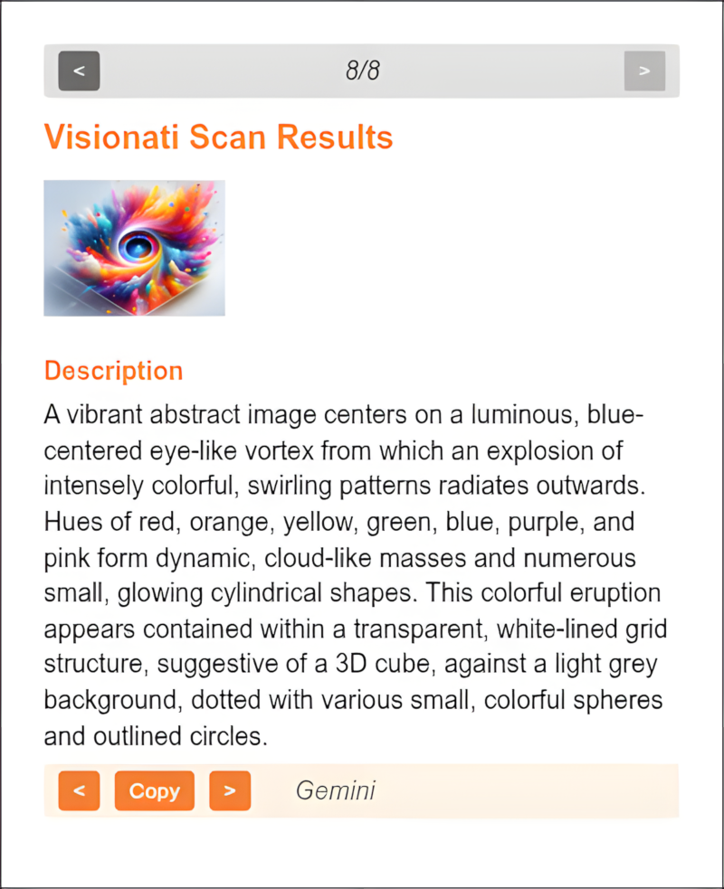

The Visionati Browser Extension lets you right-click any image on the web and instantly analyze it with multiple AI services, without leaving the page you're on.

## Why Use It

You're browsing the web and see an image that catches your eye. A plant you can't identify. A painting you want to know more about. A product you're curious about. Instead of downloading the image and uploading it somewhere else, you right-click and get answers from multiple AI models in seconds.

The extension grabs the actual image data straight from your browser and sends it to Visionati for analysis. That means if you can see an image on your screen, you can scan it, even if the image is behind a login, a paywall, or on a site that blocks outside access.

Descriptions, tags, and NSFW checks appear right in the extension popup.

## What You Get

- **Descriptions**: AI-generated text from each enabled LLM, with the source model labeled
- **Tags**: Detected objects and concepts from computer vision backends
- **NSFW**: Content moderation flags when detected

## Key Features

- **Scan history**: Review your past scans without re-analyzing. Configurable depth (5, 10, 25, or 50 scans).
- **Role and language**: Set a default role and output language in the extension options. Works with all 160 supported languages.
- **Custom prompt**: Write your own analysis instructions that apply to every scan.
- **Auto-open popup**: On Chrome, the results popup opens automatically after a scan. (Not supported in Firefox.)

## Who It's For

- **Curious browsers**: See something interesting, right-click, find out what it is. Plants, art, landmarks, products, architecture.
- **Researchers**: Quickly analyze images you encounter while browsing, without breaking your workflow.
- **Content moderators**: Spot-check images on any site with NSFW detection from multiple backends.
- **Developers**: Test how Visionati handles different images before building an integration.

## Supported Browsers

- **Google Chrome** (and Chromium-based browsers like Edge and Brave)
- **Mozilla Firefox**

## Supported Image Formats

JPEG, PNG, GIF, and WebP.