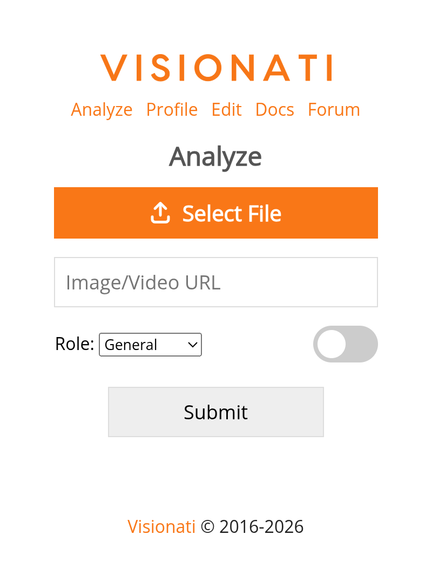

The <a href="https://api.visionati.com/analyze" target="_blank" rel="noopener">Visionati Content Analyzer</a> is a web app that sends your images and videos to multiple AI services at once, giving you the most complete analysis possible.

## Why Use It

Every AI model sees something different. One catches the plant species, another nails the architectural style, a third notices the brand logo in the background. The Content Analyzer runs multiple AI services on your image at once, so you get the most complete picture possible.

Upload an image, paste a URL, or snap a photo with your phone camera. Multiple LLMs generate descriptions while computer vision backends tag every object, flag NSFW content, and surface details no single model would catch on its own. Flip between descriptions to find the best one, or use tags from multiple backends to build the most accurate metadata.

## What You Get

- **Descriptions**: AI-generated text from each enabled LLM, with arrows to page between them
- **Tags**: Detected objects and concepts, bolded when multiple backends agree
- **NSFW**: Content moderation warnings when flagged

Results can be copied to your clipboard or shared directly on X.

## Who It's For

- **Curious people**: Identify plants, landmarks, art, architecture, or anything in a photo. Point your phone camera at something and get answers from multiple AI models.
- **Ecommerce sellers**: Generate product descriptions from product photos. Use the ecommerce role for copy that highlights features and selling points.
- **Real estate agents**: Turn property photos into listing descriptions. The realtor role covers room layout, architectural style, and selling points.
- **Content creators**: Get captions, alt text, or social media copy. The tweet role writes posts with hashtags, the caption role keeps it short.
- **Media and publishing**: Tag and describe photos for asset libraries. Multiple backends catch details a single model might miss.
- **Content moderators**: Screen images for NSFW content across multiple detection backends.
- **SaaS developers**: Evaluate which AI model works best for your use case before committing to an integration.
- **Artists and designers**: Get artistic analysis of composition, color palette, mood, and technique with the artist role.
