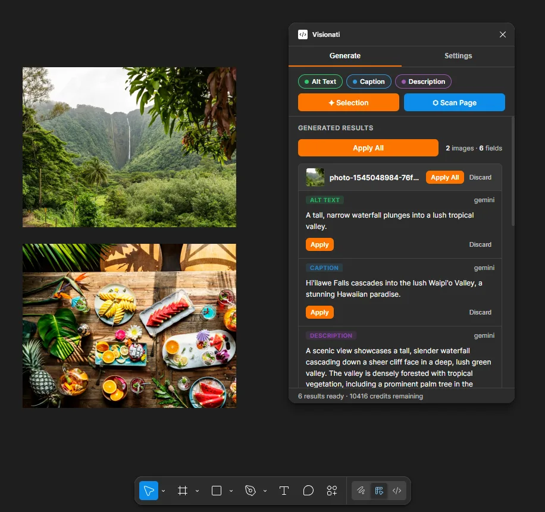

The Visionati Figma plugin generates alt text, captions, and descriptions for images in your designs, then writes them as color-coded annotations visible in Dev Mode during developer handoff.

## Why Use It

Designers hand off Figma files with empty alt text. Developers ship it that way. Accessibility gets skipped not because anyone decided to skip it, but because nobody wrote the copy at the design phase.

Visionati fixes this at the source, before handoff. Select your image layers, pick which fields you need, and the plugin writes the results directly to Figma's annotation system. Developers see them in Dev Mode without opening the plugin.

## What You Get

- **Alt text**: Short, accessibility-focused descriptions for screen readers and developer handoff. Written as green annotations.
- **Captions**: Brief text for displaying alongside images. Written as blue annotations.
- **Descriptions**: Longer, detailed descriptions for content or documentation. Written as violet annotations.

Each field uses the right AI persona automatically (Alt Text role, Caption role, General role). You can override any of them with a custom prompt.

## Key Features

- **Preview before apply**: Generate, review, then Apply or Discard per field. Nothing is written to the document until you say so.
- **Three color-coded fields**: Alt Text (green), Caption (blue), Description (violet). Each is a separate annotation category visible in Dev Mode. Generate one, two, or all three.
- **Batch process entire pages**: Click Scan Page to find and process every image node on the current page. Images are batched automatically.
- **Annotations in Dev Mode**: Results are written using Figma's first-party Annotations API. Developers see them during handoff without needing the plugin.
- **7 AI models**: Claude, Gemini, OpenAI, Grok, Jina AI, LLaVA, and BakLLaVA. Pick one in Settings. See [AI Backends](/reference/backends/).
- **Custom prompts**: Write your own instructions to override the default roles for all fields. See [Roles](/reference/roles/).
- **160+ languages**: Set your language once and every generation uses it. See [Supported Languages](/reference/languages/).
- **Current Annotations**: Select any node to see its existing annotations in the plugin panel. Edit text inline or remove annotations without leaving the plugin.
- **Results cached per selection**: Switch away to check something, come back, and your unfinished results are still there.

## Who It's For

- **Designers**: Write alt text and captions at the design phase instead of retrofitting them later.
- **Design systems teams**: Enforce accessibility copy as part of the component workflow.
- **Accessibility leads**: Audit and fill in missing alt text across an entire page in one pass.
- **Agencies**: Generate image copy in any of 160+ languages for multilingual design deliverables.
- **Developers**: Check what the designer intended by reading annotations directly in Dev Mode.

## Requirements

- Figma desktop app or browser
- A Visionati API key ([sign up](https://api.visionati.com/signup))

Annotations are visible in Figma's native design panel on paid plans. On free plans, the plugin's Current Annotations section shows all annotations for selected nodes.

## Pricing

The plugin itself is free. You pay for Visionati API credits when you generate descriptions. Cost depends on which AI model you choose. See [Credit System](/reference/credits/) for details.

## Get the Plugin

The plugin will be available on the [Figma Community](https://www.figma.com/community) plugin directory. See [Usage](/figma-plugin/usage/) for installation and setup instructions.